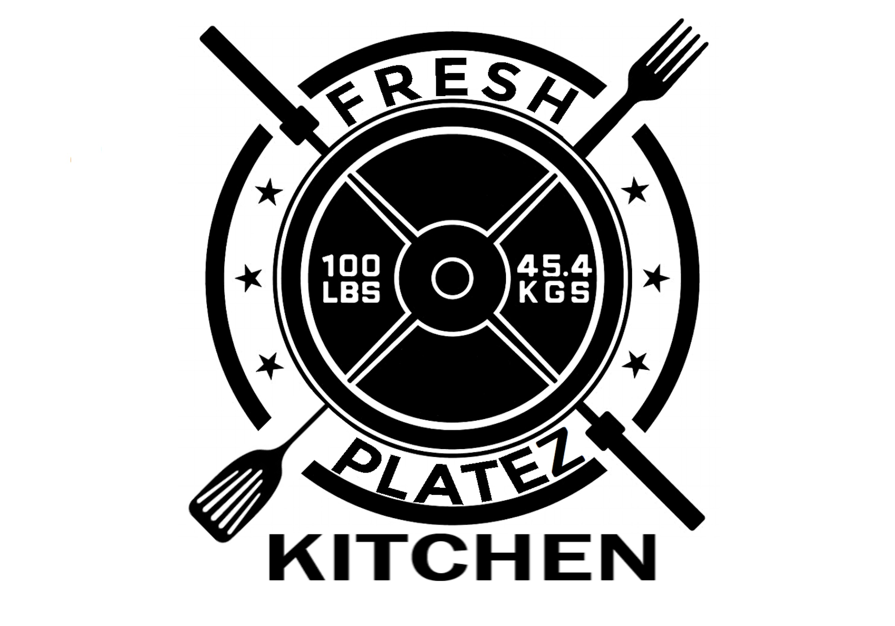

# Fresh Platez Ecommerce App

https://rocky-lake-19266.herokuapp.com

## Members:
- Brian Ellis: https://github.com/TheBrellis
- Chris Walters: cpwalters75@gmail.com
- Dan DeButts: dan.debutts@gmail.com
- John D McCutchen: https://www.linkedin.com/in/johndmccutchen/
---
## Background:

This application is being developed for a local chef who owns and operates a prepaired meals food service.

    User Stories:

        As an Athlete,
        I want to order prepaired meals,
        So that I can focus on my fitness.

        As a business owner,
        I want my customers to be able to order online,
        So that I can better serve them and improve the quality of my business. 

## Technologies:

    * SEVN: SQL, Express,Vue, Node  
    * Mailgun: Email notifications
    * VUEX : State Management
    * Vue Router: Page Routing 
    * Vuetify: Framework for FrontEnd Design
    * Sequelize: Promise based Node.js ORM for SQL queries. 

## Future Improvements:	

    + Set up user verification/logins using either Firebase or Passport
    + Set up payment processing with Stripe
    + Improve formatting of emails, provide two types of email notification  for users and admin. 
    + Improve admin page functionality, including view of active orders and tracking of sales by meal and size. 
    + Further testing and review for improved UX. 
    + Delivery confirmation notification
    + User meal planning page to help customer plan out their weekly meals

